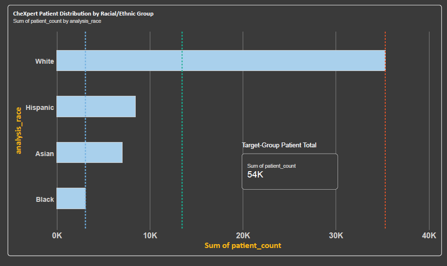

# Demographic Data Analysis (SQL, PowerBI, Python)

## 1. Objective

### Purpose

To characterize the demographic composition of the CheXpert dataset and identify potential sources of imbalance or variation that could influence the performance of computer-aided diagnosis (CAD) models across racial & ethnic groups.

### Research Goal

Understand how demographic representation may affect the evaluation of CAD model performance across racial and ethnic groups.

---

## 2. Race Distribution

### Questions
- How many patients belong to each racial group?
- What percentage of the target groups does each group represent?
- Is the dataset racially imbalanced?

### SQL Analysis

The race distribution was analyzed using the `PRIMARY_RACE` and
`ETHNICITY` fields. Because the original categories contained
multiple representations of race and ethnicity, the fields were
standardized into an `analysis_race` variable.

### Results

| Group | Patients | Percentage |
|---|---:|---:|
| White | 35,302 | 65.56% |
| Hispanic | 8,451 | 15.70% |
| Asian | 7,021 | 13.04% |
| Black | 3,071 | 5.70% |

### Visualization

### Interpretation

The four target groups are unevenly represented in the dataset. White patients make up the largest group (65.6%), while Black patients make up the smallest group (5.7%)

This substantial imbalance is important to consider when evaluating
CAD performance across racial/ethnic groups, as differences in
representation may affect model training and evaluation.

---

## 3. Demographic Statistics

### Age

#### Questions

- What is the age distribution of the dataset?
- Does age differ across racial groups?

#### Results

| Race     | Patients | Mean Age | Median | Mode | Min | Max |
| -------- | -------: | -------: | -----: | ---: | --: | --: |
| White    |   35,302 |    63.92 |     65 |   64 |   1 | 106 |
| Asian    |    7,021 |    60.94 |     63 |   67 |   0 | 103 |
| Black    |    3,071 |    55.41 |     56 |   55 |   0 | 110 |
| Hispanic |    8,451 |    51.40 |     51 |   57 |   0 | 107 |

#### Interpretation
Age differed across the four target racial/ethnic groups. White patients had the highest mean age (~64 years) and median age (65 years), while Hispanic patients had the lowest mean age (~51 years) and median age (51 years). The difference in mean age between these groups was approximately 13 years
---

### Gender

#### Questions

- What is the gender distribution?
- Does gender distribution differ across racial groups?

#### Results
The percentages below represent the proportion of the four target-group population (53,845 patients) represented by each race-gender subgroup.

| Race     | Patients | Female (% of Target Groups) | Male (% of Target Groups) |
| -------- | -------: | --------------------------: | ------------------------: |
| White    |   35,302 |                      28.81% |                    36.76% |
| Hispanic |    8,451 |                       7.07% |                     8.62% |
| Asian    |    7,021 |                       6.18% |                     6.86% |
| Black    |    3,071 |                       2.82% |                     2.88% |

#### Interpretation
Male patients represented a slightly larger proportion of the target-group population across each racial/ethnic classification. White males represented the largest race-gender subgroup (36.76%), while Black females represented the smallest (2.82%).
---

## 4. Data Quality

### Missing Values

**Race:** 541 patients missing race
**Ethnicity:** 84 patients missing ethnicity
**Gender:** 1 patient with unknown gender

### Inconsistent Values

The original demographic data contains multiple representations of the same racial categories, such as:

- White
- White, non-Hispanic
- White or Caucasian
- Black or African American
- Black, non-Hispanic
- Asian
- Asian, non-Hispanic

### Uncertain Labels

The dataset also contains categories such as:

- Unknown
- Race and Ethnicity Unknown
- Patient Refused
- Other

These were not assigned to one of the four target racial/ethnic groups.

---

## 5. Key Findings

- The CheXpert patient population is racially imbalanced among the four target groups, with White patients representing the largest group and Black patients representing the smallest.
- Age distributions differ across racial groups, with a ~13-year difference in mean age between the White and Hispanic groups.
- Male patients represent a slightly larger proportion of the dataset across racial/ethnic groups.
- The demographic differences identified in this analysis should be considered when evaluating CAD model performance across racial groups.

---

## 6. Data Cleaning Decisions

**Race Standardization**

    Raw race and ethnicity values were standardized into the following analysis categories:
        White, Black, Asian, Hispanic, and Other/Unknown.

    Hispanic classification was prioritized when the ethnicity field indicated 'Hispanic/Latino' or when the race field contained a Hispanic-specific classification.

**Missing/Uncertain Demographics**

    Missing, unknown, refused, and otherwise unclassified demographic values were retained as 'Other/Unknown' rather than being assigned to a target racial/ethnic group. For the demographic comparisons above, only the four target groups—White, Hispanic, Asian, and Black—were included.

---

## 7. SQL Queries

SQL queries used for this analysis are located in the sql/ directory.

